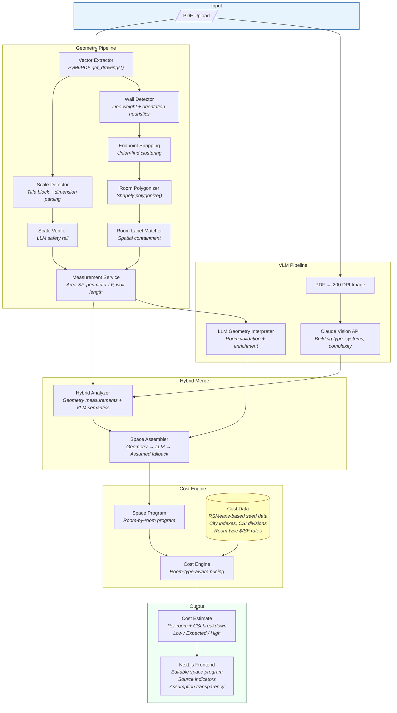

# Cantena Takeoffs

**AI-powered construction cost estimation from architectural drawings.**

Upload a construction floor plan PDF and get a room-by-room conceptual budget in under 60 seconds. Cantena combines vector geometry extraction from CAD-exported PDFs with vision language model (VLM) semantic analysis to produce accurate, transparent cost estimates that construction project managers can trust and refine.

## What It Does

Cantena solves the "napkin math" problem in early-stage construction budgeting. Instead of an estimator spending hours manually measuring drawings and looking up cost data, Cantena:

1. **Extracts real measurements** from PDF vector geometry — wall lengths, room areas, building perimeters — calibrated to architectural scale (1/4"=1'-0", 1/8"=1'-0", etc.)
2. **Identifies building characteristics** via Claude vision AI — structural system (steel frame, wood frame, concrete), exterior wall type (curtain wall, brick veneer), MEP systems, and complexity
3. **Detects individual rooms** using Shapely polygon reconstruction from wall segments, then labels them from drawing text (Living Room, Kitchen, Utility, etc.)
4. **Prices each room at its own rate** — kitchens cost more than bedrooms (cabinets, plumbing, appliances); bathrooms cost more than corridors (fixtures, tile, waterproofing)
5. **Produces a CSI division breakdown** with confidence ranges (low/expected/high) and full assumption transparency — every number traces back to a source

The result is a conceptual estimate that a PM can review, adjust, and trust — not a black-box number.

## Architecture



### Data Flow Summary

| Stage | What Happens | Source |
|---|---|---|
| **Vector Extraction** | Pull lines, rects, curves from PDF as structured coordinates | PyMuPDF |
| **Scale Detection** | Parse `1/4"=1'-0"` from title block, verify via LLM | Regex + Claude |
| **Wall Detection** | Identify structural walls by line weight + orientation | Heuristics |
| **Room Polygonization** | Snap endpoints, reconstruct enclosed room polygons | Shapely |
| **Room Labeling** | Match text labels to polygons via spatial containment | Text extraction |
| **VLM Analysis** | Identify building type, structural system, complexity | Claude Vision |
| **Hybrid Merge** | Geometry for measurements, VLM for semantics | Both |
| **Space Assembly** | Build room-by-room program (geometry > LLM > assumed) | Priority chain |
| **Room-Type Pricing** | Kitchen @ $280/SF, utility @ $150/SF, bathroom @ $400/SF | RSMeans-based data |
| **CSI Breakdown** | Divide 03 Concrete, Div 05 Metals, Div 23 HVAC, etc. | % distribution |

### PRD Roadmap

The system was built incrementally across 6 PRDs, each layering on the last:

| PRD | Name | What It Added |
|---|---|---|
| **1** | Cost Engine Foundation | Domain models, cost data, estimation engine, formatting |
| **2** | Product Pipeline | PDF processing, VLM analysis, FastAPI backend, Next.js frontend |
| **3** | Geometry Engine | Vector extraction, scale detection, wall detection, measurements |
| **3.5** | Geometry Validation | Integration tests against a real architectural drawing |
| **3.75** | LLM-Enhanced Geometry | Room polygonization, label matching, LLM enrichment, scale verification |
| **4** | Enhanced Cost Intelligence | Room-type cost data, SpaceProgram, per-room pricing, editable UI |

## Prerequisites

- Python 3.11+
- Node.js 20+
- Docker and Docker Compose (optional, for containerized setup)
- (Optional) An [Anthropic API key](https://console.anthropic.com/) for VLM-based drawing analysis

## Quick Start

```bash
# 1. Clone and enter the project
cd takeoffs

# 2. Copy env file and add your API key (optional)
cp .env.example .env

# 3. Start both services
docker compose up

# 4. Open the app
open http://localhost:3000/analyze
```

The app runs on:
- **Frontend:** http://localhost:3000
- **Backend API:** http://localhost:8000

No API key? Click **Try sample estimate** on the analyze page to see a demo.

## Development (without Docker)

### Backend

```bash
cd backend
python3 -m venv .venv
source .venv/bin/activate
pip install -e ".[dev]"

# Run the server
uvicorn cantena.api.app:create_app --factory --reload

# Quality gates
pytest
mypy --strict cantena
ruff check cantena tests
```

### Frontend

```bash
cd frontend
npm install
npm run dev

# Quality gates
npm run typecheck
npm run lint
```

## Project Structure

```
backend/
  cantena/
    api/          # FastAPI endpoints (/api/analyze, /api/estimate, /api/debug/geometry)
    data/         # Cost data, CSI divisions, city indexes, room-type costs
    geometry/     # Vector extraction, scale detection, walls, rooms, snapping, measurement
    models/       # Pydantic domain models (BuildingModel, CostEstimate, SpaceProgram)
    services/     # PDF processor, VLM analyzer, hybrid analyzer, LLM interpreter, pipeline
    engine.py     # CostEngine: BuildingModel + SpaceProgram -> CostEstimate
    factory.py    # create_default_engine()
  tests/          # Unit + integration test suite
    integration/  # Real-PDF validation tests (first-floor.pdf)

frontend/
  src/
    app/analyze/  # Upload UI + results display (editable space program, CSI breakdown)
    lib/          # TypeScript types, API client

tasks/            # PRD documents (ordered 1 → 4)
test_pdfs/        # Fixture PDFs for integration testing
```

## Key Concepts

- **CostRange**: Every cost is low/expected/high — never a single number. Matches RSMeans ROM accuracy of +/-20-25%.
- **SpaceProgram**: Room-by-room breakdown with source tracking (geometry, LLM, assumed, user override).
- **Hybrid Analysis**: Geometry engine for accurate measurements + VLM for semantic interpretation = better than either alone.
- **Assumption Transparency**: Every number traces back to a source. PMs see exactly what was measured, what was AI-inferred, and what was assumed.
